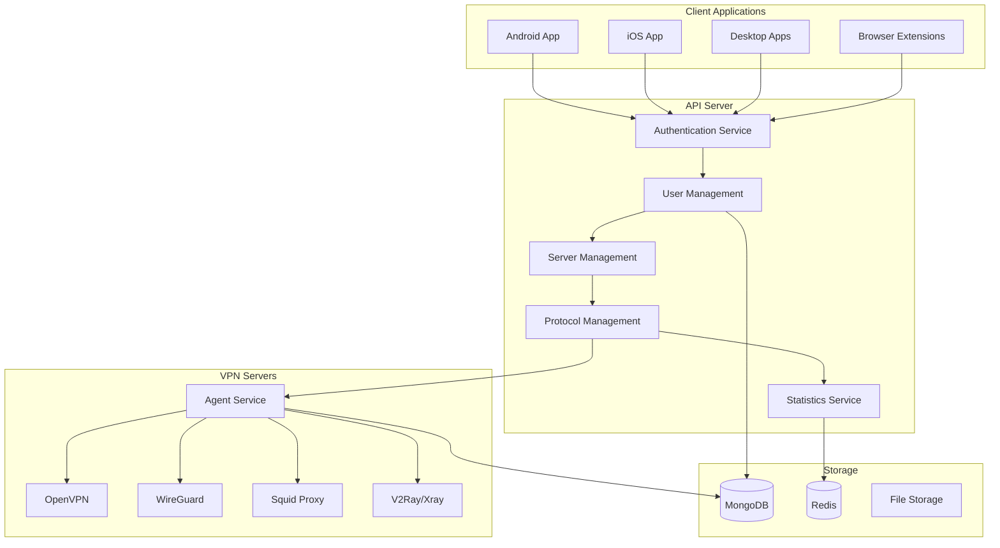

# VPN Management Platform - Implementation Plan

## 🎯 Project Overview

Transform the current VPN monitoring system into a comprehensive VPN management platform with:

1. **Protocol Installation Scripts** - Automated setup for OpenVPN, WireGuard, Squid, V2Ray
2. **Enhanced Agent** - User management, profile generation, server management
3. **Enhanced API** - Complete user/protocol management, statistics, authentication
4. **Enhanced Dashboard** - Protocol management, user management, detailed statistics
5. **Multi-Platform Clients** - Android, iOS, macOS, Windows, Linux, Browser Extensions
6. **Authentication System** - Username/password, email/OTP, OAuth (Google, Apple), anonymous

---

## 📋 Project Scope & Complexity

> [!WARNING]
> This is an **extremely large project** that typically requires:
> - **Team Size**: 3-5 developers
> - **Timeline**: 3-6 months for MVP
> - **Expertise Required**: Backend, Frontend, Mobile (Flutter), DevOps, Security
> - **Estimated Code**: 50,000+ lines across all components

### Recommended Approach

I can help you build this in **phases**:

**Phase 1** (Weeks 1-2): Protocol Installation Scripts + Basic User Management
**Phase 2** (Weeks 3-4): Enhanced API + Agent with User Management
**Phase 3** (Weeks 5-6): Enhanced Dashboard with Statistics
**Phase 4** (Weeks 7-10): Flutter Mobile Apps (Android/iOS/Desktop)
**Phase 5** (Weeks 11-12): Browser Extensions

---

## 🏗️ Architecture Overview



---

## 📦 Component Breakdown

### 1. Protocol Installation Scripts

#### Files to Create:
- `scripts/install-openvpn.sh` - OpenVPN installation and configuration
- `scripts/install-wireguard.sh` - WireGuard installation and configuration
- `scripts/install-squid.sh` - Squid proxy installation and configuration
- `scripts/install-v2ray.sh` - V2Ray/Xray installation and configuration
- `scripts/install-all.sh` - Master installation script

**Features:**
- Automated installation with minimal user input
- SSL certificate generation (Let's Encrypt)
- Firewall configuration
- Service management
- Configuration templates

---

### 2. Enhanced Agent

#### Files to Modify/Create:
- `agent/monitor.py` - Existing monitoring (keep)
- `agent/user_manager.py` - **NEW** - User CRUD operations
- `agent/profile_generator.py` - **NEW** - Generate VPN profiles
- `agent/protocol_manager.py` - **NEW** - Manage protocol services
- `agent/api_client.py` - **NEW** - Communication with API server

**New Capabilities:**

##### User Management
- Create VPN users for each protocol
- Delete users
- Update user quotas/limits
- List active users
- Get user statistics

##### Profile Generation
- OpenVPN: `.ovpn` files
- WireGuard: `.conf` files
- Squid: Proxy credentials
- V2Ray: VMess/VLESS links

##### Protocol Management
- Start/stop services
- Update configurations
- Monitor service health
- Collect protocol-specific stats

---

### 3. Enhanced API

#### Files to Modify/Create:

##### Authentication (`api/auth.py`)
- **Existing**: JWT authentication
- **NEW**: Email/OTP verification
- **NEW**: OAuth (Google, Apple)
- **NEW**: Anonymous sessions
- **NEW**: Password reset flow

##### User Management (`api/users.py`)
- **Existing**: Admin user management
- **NEW**: VPN user management (separate from admin users)
- **NEW**: User quotas and limits
- **NEW**: User statistics

##### Protocol Management (`api/protocols.py` - **NEW**)
- CRUD operations for protocol configurations
- Enable/disable protocols per server
- Protocol-specific settings

##### VPN User Management (`api/vpn_users.py` - **NEW**)
- Create VPN users
- Delete VPN users
- Update user profiles
- Get user connection history
- Download user profiles (.ovpn, .conf, etc.)

##### Statistics (`api/statistics.py` - **NEW**)
- Total users per protocol
- Active connections
- Bandwidth usage
- Historical data (daily, weekly, monthly)
- Per-server, per-protocol, or global stats

##### Server List (`api/servers.py`)
- **Existing**: Server monitoring
- **NEW**: Protocol availability per server
- **NEW**: Server capacity and user limits

**New Database Models:**

```python
# VPN Users (different from admin users)
{
    "_id": ObjectId,
    "username": str,
    "email": str,
    "password_hash": str,  # For app login
    "subscription_tier": str,  # free, premium, etc.
    "created_at": datetime,
    "expires_at": datetime,
    "protocols": {
        "openvpn": {"enabled": bool, "username": str, "password": str},
        "wireguard": {"enabled": bool, "public_key": str, "private_key": str},
        "squid": {"enabled": bool, "username": str, "password": str},
        "v2ray": {"enabled": bool, "uuid": str}
    },
    "quota": {
        "bandwidth_limit_gb": int,
        "bandwidth_used_gb": float,
        "device_limit": int
    }
}

# Connection History
{
    "_id": ObjectId,
    "user_id": ObjectId,
    "server_ip": str,
    "protocol": str,
    "connected_at": datetime,
    "disconnected_at": datetime,
    "bytes_sent": int,
    "bytes_received": int
}

# Protocol Configurations
{
    "_id": ObjectId,
    "server_ip": str,
    "protocol": str,  # openvpn, wireguard, squid, v2ray
    "enabled": bool,
    "config": dict,  # Protocol-specific settings
    "port": int,
    "max_users": int,
    "current_users": int
}
```

---

### 4. Enhanced Dashboard

#### Files to Modify:
- `dashboard/index.html` - **MAJOR UPDATE**

**New Features:**

##### Protocol Management Tab
- View all protocols per server
- Enable/disable protocols
- Configure protocol settings
- View protocol-specific stats

##### VPN User Management Tab
- Create new VPN users
- Search/filter users
- View user details
- Delete users
- Reset passwords
- Download user profiles

##### Statistics Dashboard
- **Overview Cards**:
  - Total VPN users
  - Active connections
  - Total bandwidth used
  - Revenue (if applicable)

- **Charts**:
  - Connections over time (line chart)
  - Users per protocol (pie chart)
  - Bandwidth per server (bar chart)
  - Geographic distribution (map)

- **Filters**:
  - Date range selector
  - Protocol filter
  - Server filter

##### Server Inventory (Enhanced)
- **Existing**: Server status, load
- **NEW**: Protocol availability badges
- **NEW**: User count per protocol
- **NEW**: Quick actions (add user, download profile)

---

### 5. Multi-Platform Client Applications

#### Technology Stack Recommendation

**Mobile & Desktop**: **Flutter** (Single codebase for all platforms)
- ✅ Android
- ✅ iOS
- ✅ macOS
- ✅ Windows
- ✅ Linux

**Browser Extensions**: JavaScript/TypeScript
- Chrome/Edge (Chromium-based)
- Firefox

#### Flutter App Structure

```
vpn_client/
├── lib/
│   ├── main.dart
│   ├── models/
│   │   ├── user.dart
│   │   ├── server.dart
│   │   └── vpn_config.dart
│   ├── services/
│   │   ├── api_service.dart
│   │   ├── auth_service.dart
│   │   ├── vpn_service.dart
│   │   └── storage_service.dart
│   ├── screens/
│   │   ├── auth/
│   │   │   ├── login_screen.dart
│   │   │   ├── signup_screen.dart
│   │   │   └── otp_verification_screen.dart
│   │   ├── home/
│   │   │   ├── home_screen.dart
│   │   │   └── server_list_screen.dart
│   │   ├── settings/
│   │   │   └── settings_screen.dart
│   │   └── profile/
│   │       └── profile_screen.dart
│   ├── widgets/
│   │   ├── server_card.dart
│   │   ├── connection_button.dart
│   │   └── stats_widget.dart
│   └── utils/
│       ├── constants.dart
│       └── theme.dart
├── android/
├── ios/
├── macos/
├── windows/
├── linux/
└── pubspec.yaml
```

**Key Flutter Packages:**
- `flutter_vpn` or `openvpn_flutter` - VPN connectivity
- `wireguard_flutter` - WireGuard support
- `http` / `dio` - API communication
- `provider` / `riverpod` - State management
- `shared_preferences` - Local storage
- `google_sign_in` - Google OAuth
- `sign_in_with_apple` - Apple Sign In
- `firebase_auth` - Email/OTP verification

**Features:**
1. **Authentication**:
   - Login/Signup with username/password
   - Email/password with OTP verification
   - Google Sign-In
   - Apple Sign-In (iOS/macOS)
   - Anonymous mode (no login)

2. **Server Selection**:
   - List servers from API
   - Filter by country, protocol, load
   - Show server stats (ping, load, users)
   - Favorite servers

3. **VPN Connection**:
   - One-tap connect
   - Auto-reconnect
   - Kill switch
   - Connection status indicator
   - Speed test

4. **User Profile**:
   - View subscription details
   - Bandwidth usage
   - Connection history
   - Account settings

#### Browser Extension Structure

```
browser_extension/
├── manifest.json (Chrome/Edge)
├── manifest_firefox.json (Firefox)
├── popup/
│   ├── popup.html
│   ├── popup.js
│   └── popup.css
├── background/
│   └── background.js
├── content/
│   └── content.js
└── assets/
    └── icons/
```

**Features**:
- Proxy configuration (Squid, V2Ray)
- Server selection
- Quick connect/disconnect
- Connection status
- Lightweight UI

---

## 🔐 Authentication System

### Authentication Methods

#### 1. Username/Password
- Standard JWT-based authentication
- Password hashing with bcrypt
- Refresh tokens

#### 2. Email/Password with OTP
- Email verification on signup
- OTP sent via email (SendGrid, AWS SES, or SMTP)
- 6-digit code, 10-minute expiry
- Rate limiting to prevent abuse

#### 3. OAuth (Google)
- Google Sign-In integration
- OAuth 2.0 flow
- Store OAuth tokens securely
- Link to VPN user account

#### 4. OAuth (Apple)
- Sign in with Apple
- iOS/macOS native integration
- Privacy-focused (email relay)

#### 5. Anonymous Mode
- Generate temporary session
- Limited features (e.g., only free servers)
- No profile persistence
- Session expires after X hours

### Implementation Files

```python
# api/auth_providers/
├── __init__.py
├── email_otp.py      # Email/OTP verification
├── google_oauth.py   # Google OAuth
├── apple_oauth.py    # Apple OAuth
└── anonymous.py      # Anonymous sessions
```

---

## 📊 Statistics & Analytics

### Metrics to Track

#### User Metrics
- Total registered users
- Active users (last 24h, 7d, 30d)
- New signups per day
- Churn rate

#### Connection Metrics
- Total connections
- Active connections (real-time)
- Average connection duration
- Connections per protocol
- Connections per server

#### Bandwidth Metrics
- Total bandwidth used
- Bandwidth per user
- Bandwidth per protocol
- Bandwidth per server

#### Server Metrics
- Server uptime
- Server load (CPU, RAM, Network)
- Users per server
- Protocol availability

### Database Schema for Statistics

```python
# Daily Statistics (aggregated)
{
    "_id": ObjectId,
    "date": datetime,  # Start of day
    "total_users": int,
    "active_users": int,
    "new_users": int,
    "total_connections": int,
    "bandwidth_gb": float,
    "by_protocol": {
        "openvpn": {"connections": int, "bandwidth_gb": float},
        "wireguard": {"connections": int, "bandwidth_gb": float},
        "squid": {"connections": int, "bandwidth_gb": float},
        "v2ray": {"connections": int, "bandwidth_gb": float}
    },
    "by_server": [
        {"ip": str, "connections": int, "bandwidth_gb": float}
    ]
}
```

---

## 🚀 Implementation Phases

### Phase 1: Protocol Installation Scripts (Week 1-2)
- [ ] Create installation scripts for all protocols
- [ ] Test on clean Ubuntu/Debian servers
- [ ] Document installation process
- [ ] Create configuration templates

### Phase 2: Enhanced Agent (Week 3-4)
- [ ] Implement user management functions
- [ ] Implement profile generation
- [ ] Implement protocol management
- [ ] Add API communication layer
- [ ] Test user creation/deletion

### Phase 3: Enhanced API (Week 5-6)
- [ ] Add authentication providers (email/OTP, OAuth)
- [ ] Implement VPN user management endpoints
- [ ] Implement protocol management endpoints
- [ ] Implement statistics endpoints
- [ ] Add database models
- [ ] Write API tests

### Phase 4: Enhanced Dashboard (Week 7-8)
- [ ] Redesign UI for new features
- [ ] Add protocol management interface
- [ ] Add VPN user management interface
- [ ] Add statistics dashboard with charts
- [ ] Add filters and search
- [ ] Test all features

### Phase 5: Flutter Mobile/Desktop Apps (Week 9-12)
- [ ] Set up Flutter project
- [ ] Implement authentication screens
- [ ] Implement server list
- [ ] Integrate VPN connectivity (OpenVPN, WireGuard)
- [ ] Add proxy support (Squid, V2Ray)
- [ ] Implement user profile
- [ ] Test on all platforms
- [ ] Build and package apps

### Phase 6: Browser Extensions (Week 13-14)
- [ ] Create Chrome/Edge extension
- [ ] Create Firefox extension
- [ ] Implement proxy configuration
- [ ] Test on all browsers
- [ ] Publish to stores

---

## 📝 File Structure (Complete Project)

```
mvpn/
├── scripts/                          # NEW
│   ├── install-openvpn.sh
│   ├── install-wireguard.sh
│   ├── install-squid.sh
│   ├── install-v2ray.sh
│   └── install-all.sh
├── agent/
│   ├── monitor.py                    # EXISTING
│   ├── user_manager.py               # NEW
│   ├── profile_generator.py          # NEW
│   ├── protocol_manager.py           # NEW
│   ├── api_client.py                 # NEW
│   └── vpn-monitor.service
├── api/
│   ├── main.py                       # MODIFY
│   ├── models.py                     # MODIFY
│   ├── database.py                   # EXISTING
│   ├── auth.py                       # MODIFY
│   ├── users.py                      # MODIFY
│   ├── vpn_users.py                  # NEW
│   ├── protocols.py                  # NEW
│   ├── statistics.py                 # NEW
│   ├── servers.py                    # MODIFY
│   ├── auth_providers/               # NEW
│   │   ├── email_otp.py
│   │   ├── google_oauth.py
│   │   ├── apple_oauth.py
│   │   └── anonymous.py
│   └── requirements.txt              # MODIFY
├── dashboard/
│   └── index.html                    # MAJOR UPDATE
├── clients/                          # NEW
│   ├── flutter_app/
│   │   ├── lib/
│   │   ├── android/
│   │   ├── ios/
│   │   ├── macos/
│   │   ├── windows/
│   │   ├── linux/
│   │   └── pubspec.yaml
│   └── browser_extension/
│       ├── chrome/
│       └── firefox/
├── docker-compose.yml
├── Dockerfile
└── README.md                         # MAJOR UPDATE
```

---

## ⚠️ Important Considerations

### Security
- [ ] Implement rate limiting on all endpoints
- [ ] Add CAPTCHA for signup/login
- [ ] Encrypt VPN credentials in database
- [ ] Implement API key rotation
- [ ] Add audit logging
- [ ] Regular security audits

### Scalability
- [ ] Use Redis for session management
- [ ] Implement caching for server lists
- [ ] Use message queue for async tasks (Celery)
- [ ] Database indexing for performance
- [ ] CDN for static assets

### Compliance
- [ ] GDPR compliance (EU users)
- [ ] Data retention policies
- [ ] Privacy policy
- [ ] Terms of service
- [ ] User data export/deletion

---

## 🎯 Next Steps

I recommend we proceed in **phases**. Would you like me to:

1. **Start with Phase 1** - Create protocol installation scripts?
2. **Start with Phase 2** - Enhance the agent with user management?
3. **Start with Phase 3** - Enhance the API with new endpoints?
4. **Get a specific component** - e.g., just the Flutter app structure?

Please let me know which phase you'd like to tackle first, and I'll provide the complete implementation for that phase.

---

**Estimated Total Development Time**: 3-6 months (full-time)  
**Recommended Team**: 3-5 developers  
**Budget Estimate**: $50,000 - $150,000 (if outsourced)
